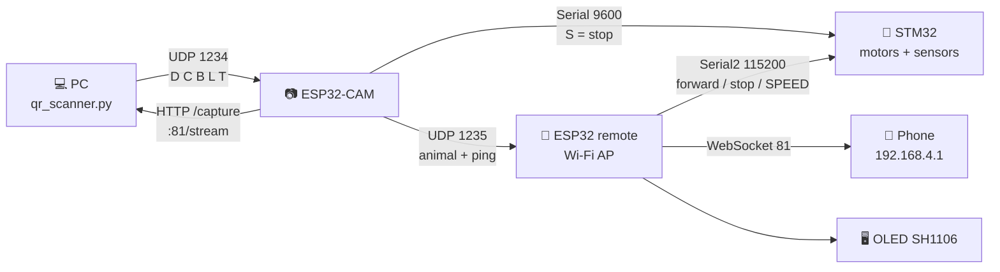

<div align="center">


# Tiny Robot

**A two-wheel line-following robot that reads QR codes, stops for the animal it finds, and draws it on its own face.**


</div>

---

## ✨ What it can do

| | |
|---|---|
| 🛣️ **Follow a line** | Five-sensor black-line following with a PD controller, bend-tolerant handling when the line drops out, and active braking at the finish line. |
| 🎮 **Take orders** | Forward, backward, left, right and stop from any phone browser, with a speed slider and an Auto/Manual switch. |
| 📷 **See** | The ESP32-CAM streams live video straight into the remote web page. |
| 🔍 **Read QR codes** | DOG, CAT, BIRD, LION and TIGER — decoded on the PC, sent back to the robot over Wi-Fi. |
| 🐕 **React** | A valid code stops the robot for five seconds and paints that animal across the OLED. |

## 🧩 How the pieces talk



## 📂 Main files

| Device | File | Function |
|:--|:--|:--|
| 🤖 STM32 | `stm32_robot_controller/stm32_robot_controller.ino` | Main robot firmware |
| 📡 ESP32 | `esp32_remote_controller/esp32_remote_controller.ino` | Wi-Fi access point, browser remote, OLED |
| 📷 ESP32-CAM | `esp32_camera_server/esp32_camera_server.ino` | Camera server and QR signal bridge |
| 💻 PC | `pc_qr_scanner/qr_scanner.py` | QR detection and UDP sender |
| 🎨 Art | `assets/oled/*.png` | Source artwork for every OLED screen, 128×64 |
| 🛠️ Tool | `tools/png_to_bitmaps.py` | Turns that artwork into `animal_bitmaps.h` |

## 🖥️ What the display shows

The OLED switches between five screens on its own. Every screen except Status is a full-screen 128×64 bitmap with its lettering already drawn into the artwork, so the firmware only blits the image.

| Screen | When | Source |
|:--|:--|:--|
| 👋 Welcome | First 2.5 s after boot (`START_SCREEN_MS`) | `Start.png` |
| 📊 Status | Robot stopped | Drawn as text: `MODE`, `SPEED`, camera IP |
| 🔎 Scanning | Whole time the robot is moving | `scan1.png`–`scan3.png` — a pair of eyes glancing left and right until a QR turns up |
| 🎯 Found | First 1 s after a QR hit (`DETECT_SHOW_MS`) | `Detected.png` |
| 🐾 Animal | Rest of the 5 s stop | `Dog.png`, `cat.png`, `Bird.png`, `Lion.png`, `Tiger.png` |

The scanning loop is the robot looking around: straight ahead for 600 ms, then 450 ms glancing left and another 450 ms right before it comes back. Each entry in `SCAN_FRAMES` carries its own duration, so a frame can be held long enough to read as a deliberate look rather than a flicker.

"Moving" is inferred on the remote from the last command it forwarded: any direction button or `MODE:AUTO` sets it, `stop` and `MODE:MANUAL` clear it. `updateScreen()` drives the whole sequence and redraws only when a frame is actually due — the still screens are drawn once and left alone.

## 🚀 Getting started

<details>
<summary><b>1. Install the toolchain</b></summary>

<br>

Install Arduino IDE, then add the STM32duino Board Manager URL in `File > Preferences`:

```text
https://github.com/stm32duino/BoardManagerFiles/raw/main/package_stmicroelectronics_index.json
```

Install `STM32 MCU based boards` from `Tools > Board > Boards Manager` and select the exact STM32 board. Install the ESP32 board package before uploading the ESP32 sketches.

Libraries for the ESP32 remote, from `Tools > Manage Libraries`:

- `WebSockets` by Markus Sattler (Links2004)
- `Adafruit GFX Library`
- `Adafruit SH110X` — the display on this robot is an SH1106
- `Adafruit SSD1306` — only if you switch `OLED_DRIVER_SH1106` back to 0

For the PC scanner:

```bash
python -m pip install opencv-python numpy pyzbar requests
```

</details>

<details open>
<summary><b>2. Run the system</b></summary>

<br>

1. Upload `stm32_robot_controller/` to the STM32.
2. Upload `esp32_remote_controller/` to the ESP32.
3. Upload the complete `esp32_camera_server/` folder to the AI Thinker ESP32-CAM. It joins the robot's own Wi-Fi automatically.
4. Connect the phone to Wi-Fi **`My_Robot`** / **`password1234`**, then open **`http://192.168.4.1`**. The camera image appears once the ESP32-CAM has joined.
5. Connect the PC to the same Wi-Fi, then run:

```bash
python pc_qr_scanner/qr_scanner.py
```

The scanner finds the camera by itself. Pass an IP to skip the search: `python pc_qr_scanner/qr_scanner.py 192.168.4.3`

</details>

> [!NOTE]
> The STM32 works by itself for motor control and line following. The ESP32 adds the web remote and the OLED; the ESP32-CAM and the PC add QR stopping.

## 🔌 Wiring

<details>
<summary><b>STM32 pin mapping</b></summary>

<br>

| Function | Pin |
|:--|:--|
| Left motor AIN1 / AIN2 | PA0 / PA1 |
| Right motor BIN1 / BIN2 | PB0 / PB1 |
| Line sensors L2/L1/C/R1/R2 | PB9 / PB8 / PB7 / PB6 / PB5 |
| Serial2 (from ESP32 remote) | PA2 TX / PA3 RX |
| Serial3 (from ESP32-CAM) | PB10 TX / PB11 RX |

The physical pins for `Serial2` and `Serial3` depend on the board and core configuration — verify them before wiring. Cross the UART signals (TX→RX, RX→TX) and share GND.

</details>

<details>
<summary><b>ESP32 remote and ESP32-CAM</b></summary>

<br>

| Function | Pin |
|:--|:--|
| OLED SDA | GPIO21 |
| OLED SCL | GPIO22 |
| To STM32 Serial2 RX (PA3) | GPIO17 (TX) |
| From STM32 Serial2 TX (PA2) | GPIO16 (RX) |
| ESP32-CAM → STM32 Serial3 RX (PB11) | GPIO14 (TX) |

The OLED is an I2C 128×64 module at address `0x3C`. Change `OLED_ADDR` if your module uses `0x3D`. If the display is missing, the sketch prints a warning and everything else still runs.

</details>

> [!WARNING]
> **Identical-looking OLED modules carry one of two controllers, and they are not interchangeable.** `OLED_DRIVER_SH1106` at the top of `esp32_remote_controller.ino` selects which one; library, display object, `begin()` call and colour constants all follow from it.
>
> | Value | Controller | Typical module |
> |:--|:--|:--|
> | 0 | SSD1306 | most 0.96 inch panels |
> | 1 | SH1106 | most 1.3 inch panels — **this robot's display** |
>
> Getting it wrong fails in a confusing way: an SH1106 driven by the SSD1306 library shows the image squeezed into the top strip of the panel with the rest left as power-on noise. The SSD1306 library uses horizontal addressing mode, which SH1106 does not implement, so the whole 1024-byte frame lands in page 0 instead of walking down all eight pages.
>
> Three sketches under `tests/` diagnose this: `test_oled_display` sweeps the I2C clock to rule out wiring, `test_oled_sh1106` tries the SH110X driver, and `test_oled_raw` talks to the panel with bare `Wire` commands to report its true height and column offset.

## 📡 Communication protocol

| From → To | Channel | Messages |
|:--|:--|:--|
| ESP32 remote → STM32 | `Serial2`, 115200, newline-terminated | `forward` `backward` `left` `right` `stop` `MODE:AUTO` `MODE:MANUAL` `SPEED:<value>` `TRIM:<value>` |
| PC → ESP32-CAM | UDP `1234` | `DOG→D` `CAT→C` `BIRD→B` `LION→L` `TIGER→T` |
| ESP32-CAM → STM32 | `Serial1`→`Serial3`, 9600 | a valid animal code becomes `S`, which triggers the five-second stop |
| ESP32-CAM → ESP32 remote | UDP `1235` | the animal code, so the OLED knows what to draw, plus `P` every 2 s so the remote learns the camera IP |
| ESP32 remote → browser | WebSocket `81` | `CAMIP:<ip>` and `ANIMAL:<name>` |
| STM32 → ESP32 remote | `Serial2`, 115200 | `T:<mode>,<action>,<base>,<left>,<right>,<turn>,<trim>,<on-line>` every 200 ms |
| ESP32 remote → PC | HTTP `GET /telemetry` | the latest `T:` line, for the CSV |
| STM32 → ESP32 remote | `Serial2`, 115200 | `T:<mode>,<base>,<left>,<right>,<turn>,<trim>,<on-line>` every 200 ms |
| ESP32 remote → PC | HTTP `GET /telemetry` | the latest `T:` line, for the CSV |

## 🎨 Screen artwork

`esp32_remote_controller/animal_bitmaps.h` is generated, not hand-written. The real source is the PNG files in `assets/oled/`, one per screen, each 128×64 — the same size as the display. To change what the robot shows, edit the PNG and run:

```bash
py tools/png_to_bitmaps.py
```

The filename becomes the variable name, so `Dog.png` becomes `bmp_dog`. The script prints an ASCII preview of every converted image and rewrites the header. Eleven images at 1024 bytes each use about 11 KB of PROGMEM.

Conversion to 1-bit uses **Otsu's method**, which picks the light/dark cut from each image's own histogram rather than using a fixed value. This matters because the scan frames are drawn dim — their brightest pixel is only 84–142 out of 255 — so a fixed cut at 128 would render them as solid black.

Adding an animal means adding a PNG here, a row in the `ANIMALS` table in `esp32_remote_controller.ino`, an entry in `ANIMAL_MAP` in `qr_scanner.py`, and one in `isAnimalCode()` in `esp32_camera_server.ino`.

## ⚙️ Motor torque tuning

> [!CAUTION]
> The motor drive is left exactly as in the version confirmed to run in the correct direction on this hardware: one pin held low, the other PWMed. **Do not swap the pin pairs in `setSpeed()`** — that reverses both motors, which flips forward/backward, flips left/right, and makes line following drive away from the line.

Weak-feeling wheels are handled by the constants at the top of `stm32_robot_controller.ino` instead:

| Constant | Default | What it does |
|:--|:--:|:--|
| `MIN_PWM` | `135` | Floor applied to any non-zero command, so the wheel always clears the breakaway point instead of just buzzing. Raise in steps of 10 if the robot still will not start moving; lower it if the slowest setting is too fast to steer. |
| `leftMotorOffset` | `25` | Corrects a robot that will not run straight because one motor is stronger. Positive takes power off the left and leans the robot left; negative takes it off the right. The **Trim** slider on the web page sets this live over `TRIM:<value>`, so it can be dialled in while the robot drives instead of one upload per guess. Range ±80. |

`MIN_SPEED` follows `MIN_PWM`, and the web slider's `min` attribute is set to the same number — change all three together.

If the wheels are still weak after tuning `MIN_PWM`, the cause is electrical rather than firmware: check the battery under load (motors sag a pack that looks fine at rest), confirm the motor supply does not come from the STM32 regulator, confirm the DRV8833 `nSLEEP` pin is pulled high, and check that the driver is not going into thermal shutdown.

The current controller uses `Kp=45`, `Kd=35` and a default `baseSpeed=180` that the web slider overrides. The slider starts at 0 and pushes its value to the robot the moment the page connects, so what it reads is what the robot has; 0 parks the robot even in auto mode; anything between 1 and `MIN_PWM` is raised to `MIN_PWM`, since below that the motors only buzz rather than turn slowly. It is a PD controller, not a full PID controller.

`Kp` multiplies an error that maxes out at 4, so the product has to stay inside what the motors can actually do. At `Kp=80` it reached 320 against a 255 range: the outer wheel saturated and the inner one reversed, turning every bend into a pivot. At 45 the peak is about 180, inside the real range, and the robot leans into a bend instead of snapping round it. Raise it if the robot cuts corners wide; lower it if it weaves down the straights.

## 🧭 Losing the line

No sensor over the line does not mean the robot is lost. A tight bend swings the line out past the end of the sensor row for a moment, and that is normal. Reacting to the first such reading makes the robot stop or lurch at every corner.

So nothing is decided for `LOST_CONFIRM_MS` = 150 ms. During that window the robot keeps turning the way it already was, using the last `lastError` — which is the direction that chases the line, and is what carries it round the corner. Most bends are over before the timer is.

If the line is still missing after that, the robot goes looking for it. Every sensor over white is not a reason to give up — it means the line is somewhere off the row and the robot has to move itself until one sensor finds it again. Stopping is reserved for the opposite reading, every sensor over black, which is the finish line.

| Constant | Default | What it does |
|:--|:--:|:--|
| `LOST_CONFIRM_MS` | `150` | How long the line may be missing before the robot acts. Raise it if the robot still lurches on tight bends. |
| `SEARCH_WHEN_LOST` | `true` | `false` makes the robot brake and leave auto mode instead of searching. |

<details>
<summary><b>How the search works</b></summary>

<br>

The robot goes looking in three stages, ordered by how likely each cause is. `lastError` remembers which side the line was on — negative for left, positive for right — and every stage leans that way first.

| Stage | For the first | What the robot does |
|:--|:--:|:--|
| 1. Back up | `BACKUP_MS` = 400 ms | Reverses, angled toward the side the line was last seen. Covers the common case of taking a bend too fast. |
| 2. Sweep | until `SEARCH_GIVE_UP_MS` | Pivots on the spot toward that side at `SWEEP_SPEED_RATIO` = 55% of base speed, then alternates, each leg wider than the last — a narrow sweep that found nothing means the line is further out. |
| 3. Give up | `SEARCH_GIVE_UP_MS` = 6 s | Brakes and leaves auto mode, rather than wandering off the table. |

`SWEEP_STEP_MS` = 220 ms sets the width of the first sweep leg; leg *n* lasts *n*+1 times that.

Sweeping is deliberately slower than ordinary steering. A pivot is the robot looking around, and spinning fast sweeps the line under the sensor row quicker than the row can register it — the robot then overshoots and keeps hunting past a line it has already crossed.

Which way the first leg goes is decided once, when a search begins, and not recomputed afterwards. With a directional hint from `lastError` it starts that way. Without one — the robot ran off a straight, so `lastError` is 0 — it starts the opposite way to last time, because a search that always begins in the same direction walks the robot further from the line every time it briefly reacquires and loses it again.

The twitching this used to cause came from starting the search at every bend, not from the search itself. `LOST_CONFIRM_MS` now absorbs those, so the search only runs when the line is genuinely gone.

</details>

## 📈 What gets logged

`qr_scanner.py` writes a CSV to the desktop, one row per line of the run, ready to open in Excel and plot.

| Column | |
|:--|:--|
| `Timestamp` | when the row was written |
| `Event` | `START`, `RUN` (once a second) or `QR` |
| `Animal`, `Sent_Code` | filled in on a `QR` row |
| `Mode` | `A` for auto, `M` for manual |
| `Base_Speed` | what the speed slider is asking for |
| `Left_PWM`, `Right_PWM` | what the motors were actually given |
| `Turn` | the PD steering output; negative is left, positive right |
| `Trim` | the drift correction in force |
| `Sensors_On_Line` | how many of the five are over black |

The motor columns are the values after `constrain`, the trim and `MIN_PWM` have all had their say, so they are what reached the motors rather than what the controller asked for. Those two differ often, and the gap is usually the answer when the robot does not do what the maths says it should.

A row a second makes `Turn` plottable against time, which shows where on the course the robot fights hardest. `Turn` repeatedly at its limit means `Kp` is asking for more than the motors have.

The STM32 sends these as a `T:` line up `Serial2` every 200 ms; the ESP32 remembers the latest one and serves it at `http://192.168.4.1/telemetry`, which the scanner polls. Blank columns mean the PC could not reach the robot on that row — the row is still written, so the columns stay aligned.

## 📈 What gets logged

`qr_scanner.py` writes a CSV to the desktop, a row a second plus a row per QR hit, ready to open in Excel and plot.

| Column | |
|:--|:--|
| `Timestamp` | when the row was written |
| `Event` | `START`, `RUN` (once a second) or `QR` |
| `Animal`, `Sent_Code` | filled in on a `QR` row |
| `Mode` | `A` for auto, `M` for manual |
| `Action` | what the robot was doing — see below |
| `Base_Speed` | what the speed slider is asking for |
| `Left_PWM`, `Right_PWM` | what the motors were actually given |
| `Turn` | the PD steering output; negative is left, positive right |
| `Trim` | the drift correction in force |
| `Sensors_On_Line` | how many of the five are over black |

`Action` is written by the firmware at each decision point, because the numbers alone do not say why: `200/80` is a robot tracking a bend and also a robot sweeping for a line it has lost, and those read identically in a spreadsheet afterwards.

| `Action` | |
|:--|:--|
| `STRAIGHT` | on the line, centre sensor |
| `TURN_LEFT`, `TURN_RIGHT` | steering back toward the line |
| `BEND` | line briefly off the sensor row, holding the last turn |
| `SEARCH` | line gone, hunting for it |
| `FINISH`, `LOST` | stopped, and why |
| `QR_STOP` | the five-second stop after a code |
| `FORWARD`, `BACKWARD`, `STOP` | driven by hand from the web page |

The motor columns are the values after `constrain`, the trim and `MIN_PWM` have all had their say, so they are what reached the motors rather than what the controller asked for. Those two differ often, and the gap is usually the answer when the robot does not do what the maths says it should.

`Turn` plotted against time shows where on the course the robot fights hardest. Repeatedly at its limit means `Kp` is asking for more than the motors have.

The STM32 sends these as a `T:` line up `Serial2` every 200 ms; the ESP32 keeps the latest one and serves it at `http://192.168.4.1/telemetry`, which the scanner polls. None of it reaches the web page — that is for driving. Blank columns mean the PC could not reach the robot on that row; the row is still written, so the columns stay aligned.

## 🏁 Deciding it has finished

A black row under every sensor means one of two things, and they are told apart by how long it lasts. A junction or a crossing line is straddled for a fraction of a second; a finish bar is straddled for much longer. The check used to make no such distinction — four sensors reading black for a single loop pass ended the run permanently, so the robot would quit mid-course at the first crossing and never try again.

While the count is high but the timer has not run out, the robot drives straight ahead, which is what a line follower should do at a junction anyway.

| Constant | Default | What it does |
|:--|:--:|:--|
| `SENSOR_BLACK_IS_LOW` | `true` | Which logic level the sensor board puts out over black. Get this wrong and the four sensors sitting on white either side of the line are counted as black, which reads as a finish line the moment the robot is placed on the course. |
| `STOP_AT_FINISH_LINE` | `true` | Set to `false` and the robot never stops itself, whatever it sees. |
| `FINISH_BLACK_COUNT` | `5` | How many of the five sensors must read black. `5` means the whole row. |
| `FINISH_CONFIRM_MS` | `40` | How long that must hold before it counts as the finish. Long enough to reject a flickering contact, short enough that the robot cannot drive over the band before the timer expires. |

While auto mode is on, the firmware prints the sensor bits three times a second:

```text
raw   0 0 1 0 0 | black 0 0 1 0 0 | count=1 base=180
```

Sit the robot on the line with the middle sensor over it and read the `black` row: it should say `0 0 1 0 0`. If it says `1 1 0 1 1`, `SENSOR_BLACK_IS_LOW` is set the wrong way round. On this robot’s board an indicator LED lights when its sensor is over white, so the one crossing the line is the dark one. Readings that never change whatever is under the sensors mean the board has no power or the signal wires are not connected.

## ✅ Confirming which firmware is running

`setup()` prints its compile timestamp:

```text
STM32 robot ready | build Sep 11 2026 16:42:03
```

Open the serial monitor at 115200 and reset the board. If the timestamp does not match the upload that was just made, the upload did not take — on a Blue Pill the usual cause is BOOT0 left at 1, which reboots into the bootloader instead of running the program.

## 🗂️ Repository layout

```text
Tiny-robot/
├── stm32_robot_controller/    🤖 robot firmware
├── esp32_remote_controller/   📡 Wi-Fi AP, web remote, OLED
├── esp32_camera_server/       📷 camera + QR bridge
├── pc_qr_scanner/             💻 QR detection on the PC
├── assets/oled/               🎨 source PNGs for the display
├── tools/                     🛠️ artwork converter
├── tests/                     🔬 hardware tests
├── experiments/               📦 old controllers and prototypes
└── examples/                  📚 unrelated ESP32-CAM examples
```
